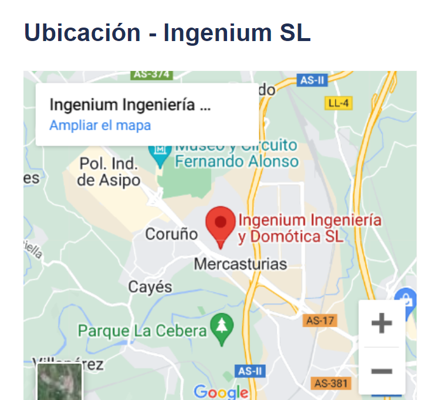

# <center> vCards-IngeniumSL </center> <br> <center></center>

El proyecto consiste en desarrollar una aplicación para IngeniumSL que exhibe a sus trabajadores y sus perfiles laborales. Cada perfil ofrece una carta de presentación y la opción de guardar los datos del trabajador para futuras interacciones. También proporciona información sobre la empresa, incluyendo horarios, contacto y ubicación, con la capacidad de compartir perfiles entre dispositivos. La aplicación cuenta además con accesos directos a las redes sociales de la empresa, como Facebook, Youtube, Instagram y Linkedin.

## Tabla de contenidos

<details>
<summary> </summary>

- [Características](#características)
- [Capturas de pantalla](#capturas-de-pantalla)
- [Tecnologias utilizadas](#tecnologias-utilizadas)
- [Acceso al proyecto](#acceso-al-proyecto)
- [Contribuir al proyecto](#cuntribuir-al-proyecto)
- [Colaboradores](#colaboradores)
- [Licencias](#licencias)
</details>

## Características 

- **Visualizacización de tarjetas de presentación** <br>
Los usuarios pueden explorar una amplia selección de tarjetas de presentación de los trabajadores de IngeniumSL.Cada tarjeta presenta una fotografía del trabajador, su nombre y cargo dentro de la empresa
- **Detalle de la tarjeta de presentación** <br>
Al hacer clic en una tarjeta de presentación, los usuarios pueden acceder a una vista detallada que muestra información adicional del trabajador. 
Esto incluye botones para poder contactar con el trabajador mediante el guardado de su teléfono, gmail, acceder a la web de la empresa y guardar el contacto 
- **Informacion de la empresa** <br>
Además de las tarjetas de presentación de los trabajadores, la aplicación proporciona informacion detallada de la empresa IngeniumSL. Los usuarios pueden acceder a detalles como los horarios de atención al cliente, información de contacto y ubicación de la empresa
- **Compartir tarjetas de presentacion** <br>
La aplicacion permite a los usuarios compartir las tarjetas de presentación con otros dispositivos mediante botones que facilitan en enlace a Gmail, Linkedin y WhatsApp o directamente el lector QR de dicha carta. 
- **Acceso a redes sociales** <br>
La parte inferior de la aplicación cuenta con cuatro botones para acceder a las siguientes redes sociales de IngeniumSL: 
    - Facebook 
    - YouTube 
    - Instagram 
    - Linkedin

<p align="right">(<a href="#">volver arriba</a>)</p>

## Capturas de pantalla 

- ### Tarjeta de presentación del empleado
 <br>

- ### Vista detellada de la tarjeta de presentación y botones de contacto 

 <br>

- ### Informacion y datos de la empresa 

 <br>
 <br>

- ### Seccion para compartir la tarjeta de presentacion del empleado y botones para acceder a las redes sociales de la empresa

 <br>

<p align="right">(<a href="#">volver arriba</a>)</p>

## Tecnologias utilizadas


<p align="right">(<a href="#">volver arriba</a>)</p>

## Acceso al proyecto

El código fuente de este proyecto está alojado en GitHub. Puedes acceder al repositorio del mismo en el siguiente enlace:

```
https://github.com/EloyParga/vCards-ingenium 
```

Si lo desea podrá clonar el proyecto para poder acceder al código fuente del mismo. Para ello, deberá abir el terminal de su dispositivo y abrir la carpeta en la que desea clonar el proyecto mediante el siguiente comando: 

``` bash
cd "Carpeta donde desea guardar el protecto
```
Seguidamente, para clonarlo y que se guarde en esa carpeta lo podra hacer tambien mediante el terminal con el siguiente comando: 

``` bash
git clone https://github.com/EloyParga/vCards-ingenium
```

Finalmente ya podrá acceder a la copia del repositorio que se encontrará en la carpeta deseada

<p align="right">(<a href="#">volver arriba</a>)</p>

## Cuntribuir al proyecto

Si lo desea, podrá contribuir al proyecto mediante la propuesta de mejoras o corrección de errores de la siguiente manera: 

- Crea un fork del siguiente repositorio

```
https://github.com/EloyParga/vCards-ingenium 
```
- Esto, creará una copia del repositorio en tu GitHub 
- Clona tu repositorio Forked localmente, para ello deberas introducir en la terminal de tu dispositivo el siguiente comando: 

```bash
git clone "Enlace-de-tu-repositorio-forked"
```

- Realiza los cambios y modificaciones que creas convenientes
- Confirma y sube tus cambios
  - Guarda los cambios que hayas realizado localmente: 

  ```bash
  cd tu-repositorio
  git add .
  git commit -m "Descripción breve de tus cambios"
  ```

  - Sube los camnios a tu repositorio

  ```bash
  git push origin main
  ```

  ***Reemplaza main con el nombre de la rama principal del repositorio si no es main.***
- Abre un nuevo Pull Request con la propuesta de mejoras o corrección de errores.


<p align="right">(<a href="#">volver arriba</a>)</p>

## Colaboradores 

Este proyecto ha sido desarrollado por el equipo de desarrollo de la empresa IngeniumSL con los siguientes colaboradores: <br> <br>

|<div style="text-align: center;"><a href="https://github.com/EloyParga"></div> | <div style="text-align: center;"><a href="https://github.com/pelayogp"></a></div> |
| - | - |

<p align="right">(<a href="#">volver arriba</a>)</p>

## Licencias

<p align="right">(<a href="#">volver arriba</a>)</p>